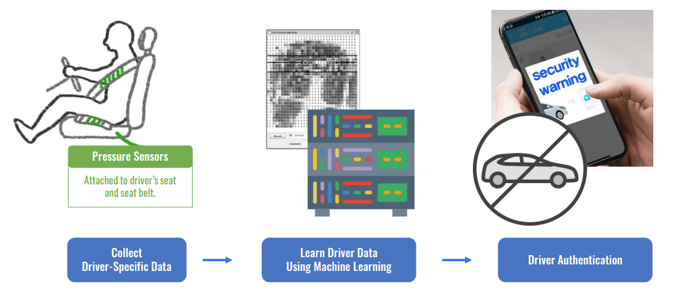
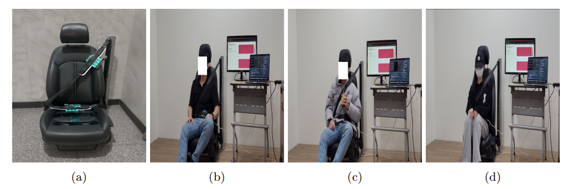
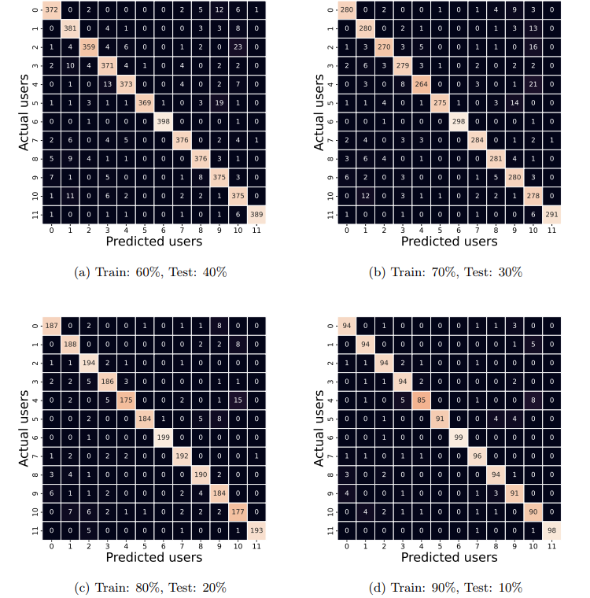
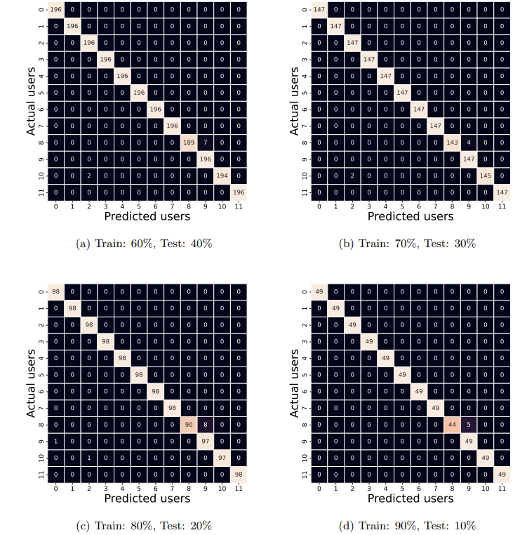

# Identifying-Car-Drivers
# 🚗 The Car is Safe: A Fast and Accurate Pressure-based Authentication System for Identifying Car Drivers

Official implementation of the MobiSec 2023 conference paper:

> **The Car is Safe: A Fast and Accurate Pressure-based Authentication System for Identifying Car Drivers** :contentReference[oaicite:0]{index=0}

---

## 📄 Paper

**Conference:** The 7th International Conference on Mobile Internet Security (MobiSec 2023)

**Authors**

- Mohsen Ali Alawami
- Dahyun Jung
- Yewon Park
- Yoonseo Ku
- Gyeonghwan Choi
- Ki-Woong Park :contentReference[oaicite:1]{index=1}

📑 Paper PDF:
https://www.researchgate.net/publication/376781776

---

## 📌 Overview

Driver authentication is an important security mechanism for preventing unauthorized vehicle access. Existing approaches commonly rely on CAN bus signals, GPS information, cameras, or smartphones, which may suffer from cybersecurity risks, privacy concerns, or long authentication delays.

This work proposes a lightweight and privacy-preserving driver authentication system using only pressure sensors installed on the driver's seat and seat belt. Pressure measurements are processed using machine learning models to identify authorized drivers within only a few seconds while maintaining high authentication accuracy. :contentReference[oaicite:2]{index=2}

---

## ✨ Key Contributions

- 🚗 Pressure-based driver authentication
- 🔒 Privacy-preserving (No camera, GPS or CAN bus data)
- ⚡ Authentication within a few seconds
- 🤖 Machine learning-based identification
- 📊 Real-world dataset collected from 12 participants
- 📈 High authentication accuracy (up to **99.61%**) :contentReference[oaicite:3]{index=3}

---

## 🏗 System Overview

<p align="center">

</p>

The proposed system continuously collects pressure measurements from sensors embedded inside the driver's seat and seat belt. The collected data are processed by trained machine learning models to authenticate the driver's identity. :contentReference[oaicite:4]{index=4}

---

## ⚙️ Authentication Pipeline

<p align="center">

</p>

The proposed framework consists of four stages:

1. Pressure data collection
2. Data preprocessing
3. Machine learning model training
4. Online driver authentication :contentReference[oaicite:5]{index=5}

---

## 🧪 Experimental Testbed

<p align="center">

</p>

The evaluation was conducted using real-world experiments involving:

- 12 participants
- 60 pressure sensors
  - 30 seat sensors
  - 30 belt sensors
- 10 repetitions per participant
- Different sitting postures
- Different clothing conditions

This resulted in a large-scale pressure dataset collected under realistic driving conditions. :contentReference[oaicite:6]{index=6}

---

## 🤖 Machine Learning Models

The following classifiers were evaluated:

- Random Forest
- Logistic Regression

Random Forest achieved the best overall performance and was selected as the primary authentication model. :contentReference[oaicite:7]{index=7}

---

## 📊 Experimental Results

### Seat-based Authentication

<p align="center">

</p>

---

### Belt-based Authentication

<p align="center">

</p>

---

### Authentication Performance

| Dataset | Accuracy | F1-score | Authentication Time |
|----------|----------|----------|---------------------|
| Belt | **99.61%** | **99.75%** | **0.54 s** |
| Seat | **94.04%** | **94.00%** | **1.34 s** |
| Belt + Seat | **96.08%** | **96.00%** | **2.32 s** |

The experimental results demonstrate that pressure-based authentication provides both fast and highly accurate driver identification while preserving user privacy. :contentReference[oaicite:8]{index=8}

---

## ⏱ Training and Testing Time

<p align="center">

</p>

Random Forest achieved superior authentication accuracy, while Logistic Regression required less computational time. The proposed system provides an effective trade-off between security, speed, and accuracy. :contentReference[oaicite:9]{index=9}

---


## 🚀 Getting Started

Clone the repository

```bash
git clone https://github.com/Mohsen-Ali-Alawami/Identifying-Car-Drivers.git
```

Install dependencies

```bash
pip install -r requirements.txt
```

Train the model

```bash
python train.py
```

Evaluate

```bash
python test.py
```

---

## 📖 Citation

If you use this repository in your research, please cite our paper.

```bibtex
@inproceedings{alawami2023car,
  title={The Car is Safe: A Fast and Accurate Pressure-based Authentication System for Identifying Car Drivers},
  author={Alawami, Mohsen Ali and Jung, Dahyun and Park, Yewon and Ku, Yoonseo and Choi, Gyeonghwan and Park, Ki-Woong},
  booktitle={The 7th International Conference on Mobile Internet Security (MobiSec)},
  year={2023}
}
```

---

## 👨‍💻 Authors

**Mohsen Ali Alawami**  
Assistant Professor  
Division of Computer Engineering  
Hankuk University of Foreign Studies (HUFS), South Korea

---

## 📬 Contact

**Mohsen Ali Alawami**

📧 Email: mohsencomm@gmail.com

- Google Scholar
- ResearchGate
- GitHub
- LinkedIn

---

## 📜 License

This project is released under the MIT License.

---

## ⭐ Star this repository

If you find this project useful, please consider giving it a ⭐ to support our research.
